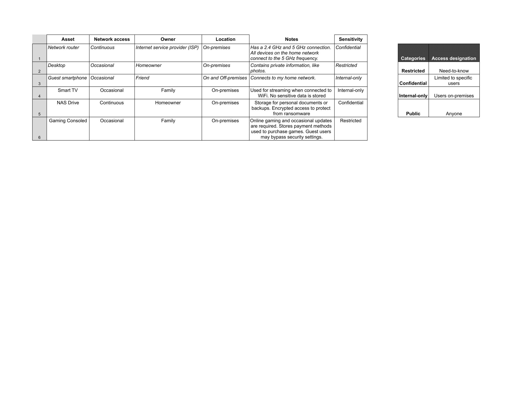

# Classifying-the-assets-connected-to-a-home-network
I will classify all assets connected to a home office network, identifying and categorizing devices by type, function, and security risk
## Scenario

## 

Review the following scenario. Then, complete the step-by-step instructions.

One of the most valuable assets in the world today is information. Most information is accessed over a network. There tend to be a variety of devices connected to a network and each is a potential entry point to other assets.

An inventory of network devices can be a useful asset management tool. An inventory can highlight sensitive assets that require extra protection.

You’re operating a small business from your home and must create an inventory of your network devices. This will help you determine which ones contain sensitive information that require extra protection.

To do this, you will start by identifying three devices that have access to your home network. This might include devices such as:

*   Desktop or laptop computers
    
*   Smartphones
    
*   Smart home devices
    
*   Game consoles
    
*   Storage devices or servers
    
*   Video streaming devices
    

Then, you’ll list important characteristics of each device such as its owner, location, and type. Finally, you will assign each device a level of sensitivity based on how important it is to protect.

